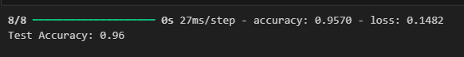

# Machine Learning Path

## Overview
We built a Machine Learning model for Temfore application using TensorFlow as the framework, and then utilized VSCode and Google Colab as the IDEs. In the process, we used pandas for data manipulation, followed by Numpy and scikit-learn for score calculations and recommendation functions.
## Dataset :

## Data Wrangling
In Data Wrangling, the application manipulates and cleans the Indonesian recipes dataset by performing several key tasks: reading and cleaning the CSV file by removing missing values and duplicates, adding a category column based on the file name, merging the cleaned data into a single file with an 'Id' column, and further cleaning the text in certain columns. In addition, it also added new columns, grouped the data by category, retrieved and downloaded recipe images from URLs, and replaced problematic characters in the data set. Finally, the cleaned data set was converted from CSV to JSON format for easy database uploading, and the results were saved in a JSON file.

## Model
The model uses a sequential architecture with an embedding layer for word representation and a bidirectional GRU layer to capture sequential context. The accuracy achieved after performing the evaluation was around 0.9570 or 0.96, showing strong performance on the classification task. After training, the model was exported in .h5 format. In addition, FastAPI was used to create an API to attempt processing.

